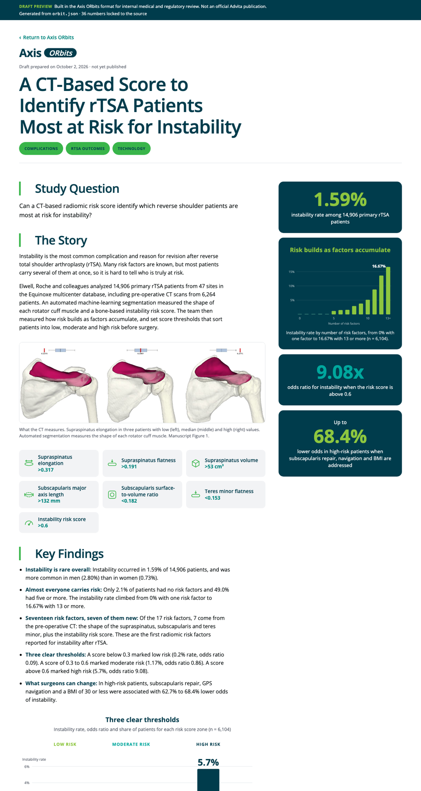
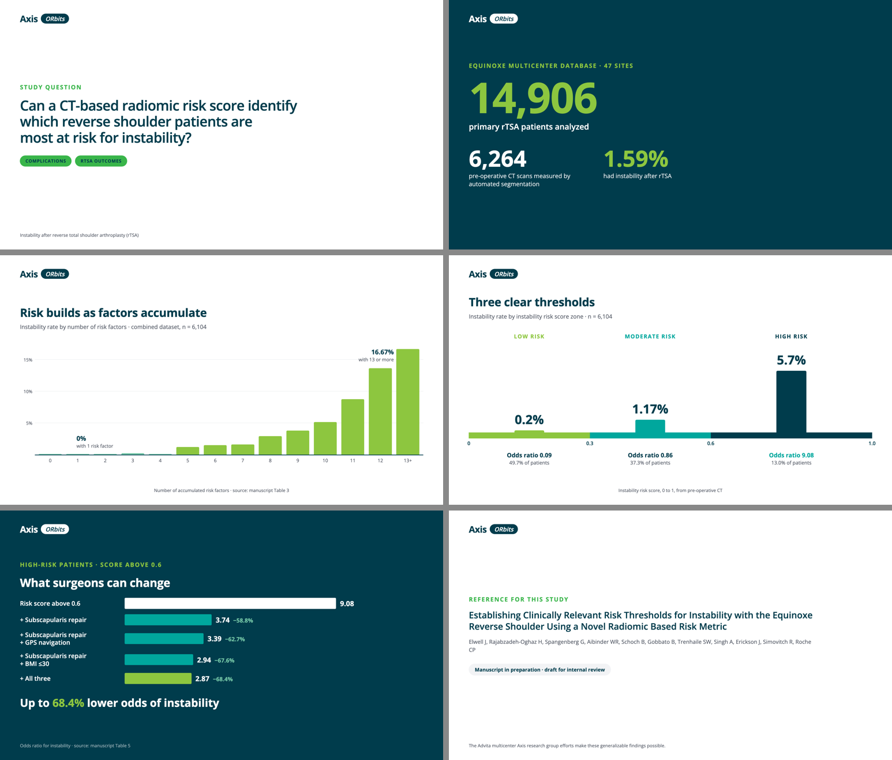
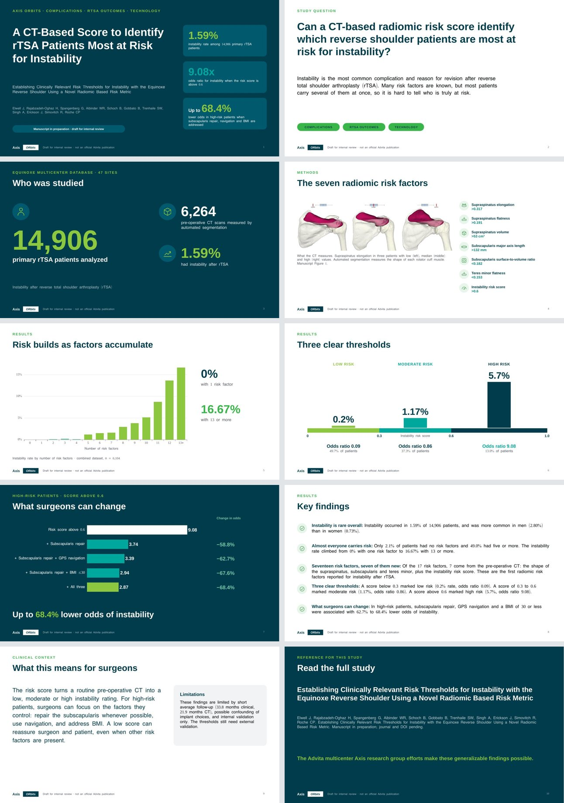

# axis-orbit

A [Claude Code](https://claude.com/claude-code) skill that turns a scientific paper (PDF or DOCX) into an **Axis ORbits** draft: a short summary page in the Advita Axis format, on-brand SVG charts, share cards, a silent animated video of the key results, and an animated PowerPoint deck in the same design system.

Every number shown is locked to a verbatim quote from the paper. A validator fails the build if a quote is missing from the paper, a value is missing from its quote, or a result number is typed into the text by hand.



## What it produces

For one paper, in `articles/<slug>/out/`:

| Output | Details |
|---|---|
| `page/index.html` | Study Question, The Story, Key Findings, Clinical Context, Limitations, Reference; sticky metric cards; in-flow charts; embedded video; media kit; evidence table (every number next to its source sentence) |
| `svg/*.svg` | Standalone charts and icons for slides and posters |
| `page/share-1200x630.png`, `share-1080.png` | Link preview and square single-number card |
| `page/orbit-video-16x9.mp4`, `-1x1.mp4` | ~30 s silent animation, 30 fps, rendered frame by frame |
| `deck/<slug>.pptx` | 10-slide PowerPoint: brand layouts, native editable charts, geometric icons, speaker notes, fade transitions and entrance animations (auto or on click) |
| `review-notes.md` | Inconsistencies found in the paper while locking numbers |





## How it works

```
paper.pdf / .docx
   │  scripts/extract.py        → source.md (text + tables) and media/ (figures)
   ▼
orbit.json  (written by Claude)  metrics[] with verbatim quotes, content with {metric_id} placeholders,
   │                             visuals, sidebar cards, video scenes, share cards
   │  scripts/validate.py       → hard gate: quotes in source, values in quotes, no bare numbers
   ▼
scripts/build_page.py   → page + SVGs
scripts/render_cards.py → share cards (Playwright screenshots)
scripts/render_video.py → deterministic renderAt(t) in HTML, captured frame by frame, encoded with ffmpeg
scripts/deck_data.py → build_deck.js (pptxgenjs) → finish_deck.py (theme, transitions, <p:timing> animations)
```

Design choices:

- **One source of truth.** The page, the charts, the cards and the video all read the same `orbit.json`.
- **No derived numbers.** Ratios, differences and "x times" claims appear only when the paper prints them.
- **No image models.** Charts are drawn to scale from the paper's tables; icons come from a small geometric set; figures come from the paper itself.
- **License-free video.** Plain HTML/CSS plus Playwright and ffmpeg. No Remotion licence needed.
- **Brand tokens** from the Advita Axis pages (Open Sans; healthygreen `#39B54A`, freshgreen `#8DC63F`, trustturquoise `#00A79D`, strengthblue `#003C4C`). No red or orange.

Visual types: `zones` (score tiers), `bars` (rate across ordered groups), `hbars` (cohorts on one effect measure), `vs` (two arms), `steps` (accumulating risk), plus counter cards and an icon list. `references/visual-library.md` has the decision rule for picking one.

## Install

Requirements: Python 3.9+, ffmpeg, Chromium for Playwright, Node 18+ (deck). LibreOffice is optional (deck preview).

```bash
pip install -r requirements.txt
npm install --prefix axis-orbit
python3 -m playwright install chromium
brew install ffmpeg   # or your platform's package manager
```

Copy the skill into a project:

```bash
mkdir -p <your-project>/.claude/skills
cp -r axis-orbit <your-project>/.claude/skills/
```

## Use

Open Claude Code in that project and run:

```
/axis-orbit path/to/paper.pdf
```

Claude extracts the paper, writes `orbit.json`, validates it, builds the page and media, renders the video, writes review notes, and publishes a private draft for review. You can also run the scripts yourself:

```bash
python3 .claude/skills/axis-orbit/scripts/extract.py paper.pdf articles/my-paper
# write articles/my-paper/orbit.json (see references/orbit-example.json)
python3 .claude/skills/axis-orbit/scripts/run_all.py articles/my-paper
```

## Files

```
axis-orbit/
├── SKILL.md                     workflow Claude follows
├── references/
│   ├── orbit-example.json       complete worked example
│   ├── visual-library.md        visual types, schema, decision rule, anti-slop checklist
│   ├── writing-guide.md         section lengths, voice, number rules
│   ├── deck.md                  PowerPoint: slide types, deck spec, animations, extending
│   └── design-tokens.json       colors, type, layout from the Axis pages
├── package.json                 Node deps for the deck (pptxgenjs, sharp)
├── scripts/                     extract, validate, build_page, render_cards, render_video,
│                                deck_data, build_deck.js, finish_deck, preview_deck, run_all
└── templates/                   page.css, page.js, video.html
```

## Notes

- Output is a **draft for medical and regulatory review**, not a publication. The page carries a draft ribbon.
- Axis, ORbits and Advita are names of Advita Ortho. This repository is not an official Advita product.

## License

MIT. See [LICENSE](LICENSE).
